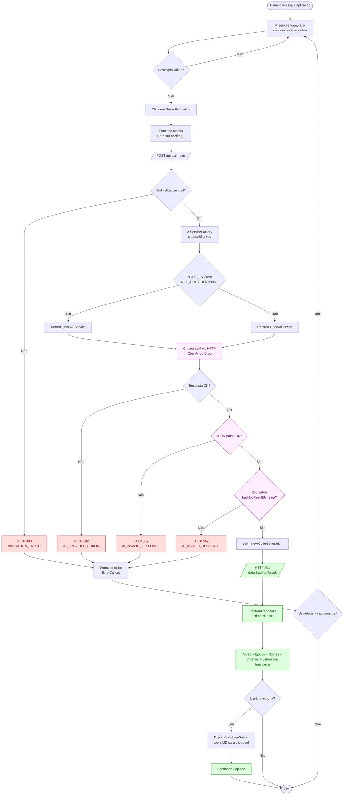

# Fluxograma de Funcionamento — MVP Estimator

> Fluxograma do funcionamento do produto, em notação Mermaid.

---

## Fluxo Principal — Geração de Estimativa

```mermaid
flowchart TD

    Start([Usuário acessa a aplicação])
    Start --> Form[Preenche formulário\ncom descrição da ideia]

    Form --> Valid{Descrição válida?}

    Valid -- Não --> Form
    Valid -- Sim --> Submit[Clica em Gerar Estimativa]

    Submit --> Loading[Frontend mostra\nGerando backlog...]

    Loading --> POST[/POST api estimates/]

    POST --> Zod{Zod valida payload?}

    Zod -- Não --> Err400[HTTP 400\nVALIDATION_ERROR]
    Err400 --> ShowErr[Frontend exibe\nErrorCallout]

    Zod -- Sim --> Factory[AIServiceFactory\ncreateAIService]

    Factory --> CheckEnv{NODE_ENV test\nou AI_PROVIDER mock?}

    CheckEnv -- Sim --> Mock[Retorna MockAIService]
    CheckEnv -- Não --> OpenAIService[Retorna OpenAIService]

    Mock --> CallLLM
    OpenAIService --> CallLLM[Chama LLM via HTTP\nOpenAI ou Groq]

    CallLLM --> Success{Resposta OK?}

    Success -- Não --> ErrLLM[HTTP 502\nAI_PROVIDER_ERROR]
    ErrLLM --> ShowErr

    Success -- Sim --> ParseJSON{JSON parse OK?}

    ParseJSON -- Não --> ErrJSON[HTTP 502\nAI_INVALID_RESPONSE]
    ErrJSON --> ShowErr

    ParseJSON -- Sim --> SchemaCheck{Zod valida\nbacklogResultSchema?}

    SchemaCheck -- Não --> ErrSchema[HTTP 502\nAI_INVALID_RESPONSE]
    ErrSchema --> ShowErr

    SchemaCheck -- Sim --> Estimate[estimateAICodeGeneration]

    Estimate --> Resp[/HTTP 201\ndata BacklogResult/]

    Resp --> Render[Frontend renderiza\nEstimateResult]

    Render --> Show[Visão + Épicos + Stories +\nCritérios + Estimativa financeira]

    Show --> Action{Usuário exporta?}

    Action -- Sim --> Export[ExportMarkdownButton\ncopia MD para clipboard]

    Export --> Toast[Feedback Copiado]
    Toast --> End([Fim])

    Action -- Não --> End

    ShowErr --> RetryQ{Usuário tenta novamente?}

    RetryQ -- Sim --> Form
    RetryQ -- Não --> End

    classDef errorNode fill:#fdd,stroke:#a00,color:#900
    classDef successNode fill:#dfd,stroke:#080,color:#060
    classDef llmNode fill:#fef,stroke:#a0a,color:#606

    class Err400,ErrLLM,ErrJSON,ErrSchema errorNode
    class Resp,Render,Show,Toast successNode
    class CallLLM,ParseJSON,SchemaCheck llmNode
```
