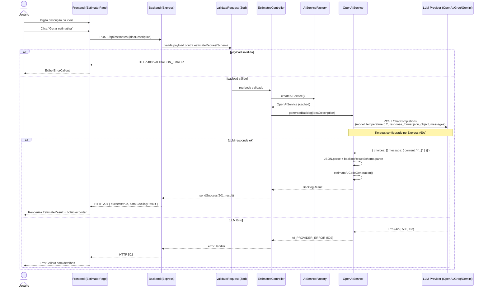
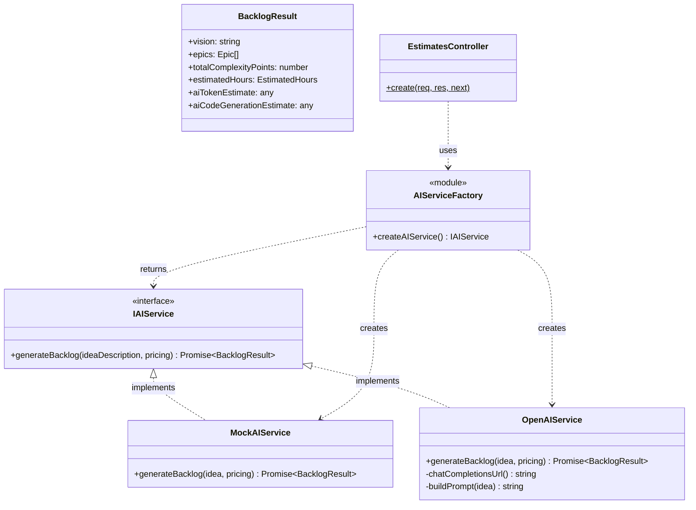
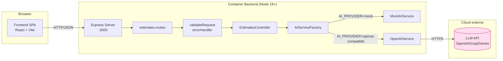

# Diagramas UML — MVP Estimator

> Diagramas gerados com auxílio de IA (Claude) a partir do código real em `src/` e `frontend/src/`. Notação Mermaid (renderizável diretamente no GitHub).

---

## 1. Diagrama de Sequência — Fluxo de geração de estimativa

---

## 2. Diagrama de Classes — Camada de Serviços de IA

---

## 3. Diagrama de Componentes — Arquitetura geral

